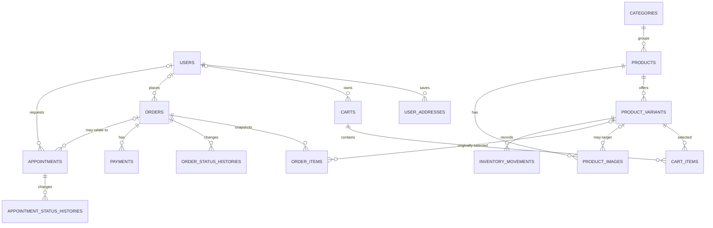

# Cơ sở dữ liệu hoàn chỉnh — Clare V1

> Cập nhật schema 2026-08-21: sơ đồ nền tảng bên dưới vẫn mô tả lõi giao dịch. Các migration cộng thêm đã bổ sung taxonomy Catalog, review, blog, settings, social account, wishlist, lịch sử xem và media; xem [`08-implementation-status-2026-08-21.md`](08-implementation-status-2026-08-21.md).

## Các bảng và quan hệ bổ sung đã triển khai

- Catalog: `category_product`, `brands`, `product_attributes`, `product_attribute_values`, `product_attribute_value_product`; `categories.parent_id`; brand và SEO trên sản phẩm/danh mục.
- Review: `product_reviews`, `product_review_images`; review ràng buộc theo khách/sản phẩm và được kiểm duyệt trước khi công khai.
- Blog: `blog_categories`, `blog_tags`, `blog_posts`, `blog_post_tag`, `blog_post_product`.
- Settings/social: `site_settings`; `google_id`, `facebook_id`, `avatar_url` trên `users`. Giá trị bí mật trong settings được mã hóa ở tầng ứng dụng.
- Customer experience: `wishlist_product`, `recently_viewed_products`; `label` trên `user_addresses`.
- Media: `media_assets`, chỉ nhận asset ảnh raster công khai đã được validation.

## Trạng thái và nguyên tắc

- MySQL chạy tại `127.0.0.1:2000`, database `clare`.
- Catalog, Cart, Checkout, Order, Payment, Inventory và Appointment đã được migrate.
- Mọi thay đổi schema dùng migration mới trong `database/migrations/`; không sửa trực tiếp database hoặc sửa migration đã chạy.
- Dùng InnoDB, `utf8mb4`, foreign key, index và `decimal(12, 2)` cho tiền. Không dùng `float` cho giá/tổng tiền.
- Soft delete chỉ dùng cho Catalog. Đơn hàng, lịch sử trạng thái và movement là dữ liệu audit nên không xóa mềm tùy tiện.

## Sơ đồ quan hệ tổng thể



## Nhóm hạ tầng Laravel — đã có

| Bảng | Cột / vai trò |
| --- | --- |
| `users` | `id`, `name`, `email` unique, `email_verified_at`, `password`, `remember_token`, timestamps |
| `password_reset_tokens` | token đặt lại mật khẩu theo email |
| `sessions` | session database khi driver session dùng database |
| `cache`, `cache_locks` | cache và lock của Laravel |
| `jobs`, `job_batches`, `failed_jobs` | queue, batch và job lỗi |
| `migrations` | Laravel ghi nhận migration đã chạy; tuyệt đối không sửa tay |

## Nhóm Catalog — đã có

### `categories`

| Cột | Kiểu / ràng buộc | Ý nghĩa |
| --- | --- | --- |
| `id` | bigint PK | Khóa chính |
| `name` | varchar | Tên nhóm |
| `slug` | varchar, unique | URL thân thiện |
| `description` | text, nullable | Mô tả category |
| `image_path` | varchar, nullable | Ảnh đại diện |
| `is_active` | boolean, indexed | Có hiển thị hay không |
| `sort_order` | unsigned integer | Thứ tự hiển thị |
| `created_at`, `updated_at`, `deleted_at` | timestamps + soft delete | Audit cơ bản |

### `products`

| Cột | Kiểu / ràng buộc | Ý nghĩa |
| --- | --- | --- |
| `id` | bigint PK | Khóa chính |
| `category_id` | nullable FK → `categories`, `SET NULL` | Một category chính trong V1 |
| `name`, `slug` | varchar; `slug` unique | Tên và URL sản phẩm |
| `short_description` | varchar(500), nullable | Nội dung ngắn cho card/detail |
| `description` | text, nullable | Nội dung đầy đủ |
| `material`, `dimensions` | varchar, nullable | Thông số V1 |
| `is_active`, `is_featured` | boolean, indexed | Hiển thị / nổi bật |
| `published_at` | timestamp nullable, indexed | Chỉ publish khi có thời điểm hợp lệ |
| timestamps, `deleted_at` | soft delete | Không hard delete catalog thông thường |

**Không có `price` hay `stock_quantity` trong bảng này.**

### `product_variants`

| Cột | Kiểu / ràng buộc | Ý nghĩa |
| --- | --- | --- |
| `id` | bigint PK | Khóa chính |
| `product_id` | FK → `products`, cascade delete | Sản phẩm cha |
| `sku` | varchar, unique | Mã bán hàng toàn hệ thống |
| `color_name` | varchar | Tên màu hiển thị |
| `color_hex` | char(7), nullable | Màu để hiển thị selector |
| `price` | decimal(12,2) | Giá bán hiện tại |
| `compare_at_price` | decimal(12,2), nullable | Giá tham chiếu trước giảm |
| `stock_quantity` | unsigned integer | Tồn có thể bán hiện tại |
| `weight_grams` | unsigned integer | Trọng lượng đóng gói dùng để báo giá vận chuyển |
| `is_active` | boolean, indexed | Biến thể có bán được không |
| `sort_order` | unsigned small integer | Thứ tự màu |
| timestamps, `deleted_at` | soft delete | Giữ lịch sử catalog |

Ràng buộc: unique theo `product_id + color_name`; index theo `product_id + is_active`.

### `product_images`

| Cột | Kiểu / ràng buộc | Ý nghĩa |
| --- | --- | --- |
| `id` | bigint PK | Khóa chính |
| `product_id` | FK → `products`, cascade delete | Ảnh luôn thuộc một product |
| `product_variant_id` | nullable FK → `product_variants`, `SET NULL` | Có thể dành riêng cho một màu |
| `disk`, `path` | varchar | Nơi và đường dẫn file lưu trữ |
| `alt_text` | varchar nullable | Accessibility/SEO |
| `sort_order` | unsigned small integer | Ảnh có số nhỏ hơn hiển thị trước |
| timestamps | audit cơ bản | |

## Nhóm tài khoản và địa chỉ — tạo khi làm Account/Admin

### Migration: `add_customer_fields_to_users_table`

| Cột mới | Kiểu / ràng buộc | Lý do |
| --- | --- | --- |
| `phone` | varchar(30), nullable, indexed | Liên hệ tài khoản; không unique vì có thể dùng chung gia đình |
| `role` | varchar(30), default `customer`, indexed | `customer`, `admin`, sau này có thể thêm `staff` |
| `is_active` | boolean, default true, indexed | Khóa tài khoản không xóa lịch sử |

Không thêm bảng roles/permissions ở V1. Nếu sau này có nhiều quyền chi tiết, mới đánh giá package hoặc bảng riêng.

### `user_addresses`

| Cột | Kiểu / ràng buộc |
| --- | --- |
| `id` | bigint PK |
| `user_id` | FK → `users`, cascade delete |
| `recipient_name`, `phone` | varchar |
| `address_line_1`, `address_line_2` | varchar; dòng 2 nullable |
| `ward`, `district`, `city`, `postal_code` | varchar; postal code nullable |
| `country_code` | char(2), default `VN` |
| `is_default` | boolean, default false |
| timestamps | audit cơ bản |

Quy tắc: chỉ Action cập nhật địa chỉ được phép đặt `is_default`, trong transaction để một user chỉ có một địa chỉ mặc định.

## Nhóm Cart — đã tạo ở Phase 3

### `carts`

| Cột | Kiểu / ràng buộc |
| --- | --- |
| `id` | bigint PK |
| `user_id` | nullable FK → `users`, `SET NULL`, indexed |
| `guest_token` | UUID/varchar(36), nullable, unique |
| `currency` | char(3), V1 dùng `VND` |
| `expires_at` | timestamp nullable, indexed |
| timestamps | audit cơ bản |

Guest cart nhận token qua cookie an toàn; sau đăng nhập, Action phải merge guest cart vào cart của user thay vì tạo item trùng.

### `cart_items`

| Cột | Kiểu / ràng buộc |
| --- | --- |
| `id` | bigint PK |
| `cart_id` | FK → `carts`, cascade delete |
| `product_variant_id` | FK → `product_variants`, `RESTRICT` khi hard delete |
| `quantity` | unsigned integer |
| `is_selected` | boolean, default true, indexed | Dòng được đưa vào báo giá và đơn hàng tiếp theo |
| timestamps | audit cơ bản |

Ràng buộc unique: `cart_id + product_variant_id`. Cart không lưu giá snapshot; giá/tồn được đọc lại và kiểm tra khi checkout. Khi tạo đơn, chỉ dòng `is_selected = true` bị chuyển sang đơn và xóa khỏi giỏ; dòng chưa chọn được giữ lại.

## Nhóm Order và Payment — đã tạo ở Phase Checkout

### `orders`

| Cột | Kiểu / ràng buộc | Ý nghĩa |
| --- | --- | --- |
| `id` | bigint PK | Khóa chính nội bộ |
| `number` | varchar(32), unique | Mã khách nhìn thấy, ví dụ `CLR-...` |
| `user_id` | nullable FK → `users`, `SET NULL`, indexed | Mọi đơn mới phải có user; nullable chỉ giữ được các dữ liệu lịch sử từ trước khi áp dụng checkout đăng nhập |
| `status` | varchar(30), indexed | `pending`, `confirmed`, `processing`, `shipped`, `completed`, `cancelled` |
| `payment_method` | varchar(30), nullable | `cod`, `bank_transfer`, `momo`, `paypal` hoặc `pay_later`; chỉ set sau khi khách chốt phương thức |
| `payment_status` | varchar(30), indexed | `unpaid`, `pending`, `paid`, `refunded`, `expired` |
| `currency` | char(3) | Đơn vị tiền do cấu hình bán hàng quyết định |
| `customer_name`, `customer_email`, `customer_phone` | varchar | Snapshot liên hệ đặt hàng |
| shipping fields | `shipping_recipient_name`, `shipping_phone`, `shipping_address_line_1`, `shipping_address_line_2`, `shipping_ward`, `shipping_district`, `shipping_city`, `shipping_postal_code`, `shipping_country_code` | Snapshot giao hàng, không phụ thuộc địa chỉ account |
| shipping quote fields | `shipping_provider`, `shipping_service`, `shipping_quote_id`, `shipping_quote_payload`, `shipping_total_weight_grams`, `shipping_estimated_days`, `shipping_fee_is_estimated` | Snapshot lựa chọn GHN/GHTK/J&T Express, quote và dữ liệu cần thiết để thay adapter thật sau này |
| `subtotal`, `shipping_fee`, `discount_total`, `total` | decimal(12,2) | Tất cả do server tính |
| `customer_note`, `admin_note`, `cancel_reason` | text nullable | Ghi chú khách/nội bộ/lý do hủy |
| `placed_at`, `confirmed_at`, `cancelled_at` | timestamp nullable, indexed khi cần | Mốc nghiệp vụ |
| fulfillment fields | `estimated_delivery_at`, `preparing_at`, `shipped_at`, `delivered_at`, `shipping_tracking_number` nullable | ETA mô phỏng, mốc vận hành và mã theo dõi sinh nội bộ khi xác nhận đơn |
| timestamps | audit cơ bản | |

`total = subtotal + shipping_fee - discount_total`; không nhận các tổng tiền này từ client một cách tin cậy.

### `promotion_codes`, `user_vouchers`, `voucher_reservations` và `order_discounts`

`promotion_codes` lưu code, tên/mô tả/banner, kiểu `percentage`/`fixed`, giá trị, đơn tối thiểu/tối đa, mức giảm tối đa, giới hạn/lượt đã dùng, giới hạn nhận/lượt cá nhân, thời gian hiệu lực, phạm vi áp dụng và trạng thái bật/công khai/cần nhận trước. `user_vouchers` là Ví voucher của khách, unique theo `user_id + promotion_code_id`, có số lượt đã dùng và thời điểm nhận. `voucher_reservations` nối ưu đãi, khách, voucher (nếu có) và order; ghi `reserved`, `redeemed` hoặc `released`, giá trị giảm snapshot và thời điểm hết hạn. Mỗi order có tối đa một reservation.

`order_discounts` giữ snapshot một ưu đãi đã áp dụng cho một order, gồm code, tên, kiểu, giá trị, số tiền giảm và tham chiếu ví voucher khi có; một order tối đa có một record. Reservation được tạo trong transaction order; lượt dùng chỉ tăng khi payment thành `paid`, và được trả lại đúng một lần nếu payment/order bị hủy hoặc hết hạn.

### `order_items`

| Cột | Kiểu / ràng buộc |
| --- | --- |
| `id` | bigint PK |
| `order_id` | FK → `orders`, cascade delete |
| `product_variant_id` | nullable FK → `product_variants`, `SET NULL` |
| `product_name`, `product_slug` | snapshot; slug nullable |
| `color_name`, `sku` | snapshot biến thể |
| `image_path` | snapshot nullable để xem lịch sử |
| `unit_price`, `line_total` | decimal(12,2) |
| `quantity` | unsigned integer |
| timestamps | audit cơ bản |

`line_total = unit_price × quantity`. Dữ liệu snapshot là nguồn hiển thị lịch sử, kể cả khi product/variant sau này đổi tên hoặc ngừng bán.

### `order_status_histories`

| Cột | Kiểu / ràng buộc |
| --- | --- |
| `id` | bigint PK |
| `order_id` | FK → `orders`, cascade delete |
| `from_status` | varchar(30), nullable |
| `to_status` | varchar(30), indexed |
| `changed_by` | nullable FK → `users`, `SET NULL` |
| `note` | text nullable |
| `created_at` | timestamp |

Mỗi Action đổi trạng thái order phải tạo một bản ghi history trong cùng transaction.

### `payments`

| Cột | Kiểu / ràng buộc |
| --- | --- |
| `id` | bigint PK |
| `order_id` | FK → `orders`, cascade delete |
| `provider` | varchar(50) |
| `provider_reference` | varchar nullable, unique |
| `amount` | decimal(12,2) |
| `currency` | char(3) |
| `status` | varchar(30), indexed |
| `paid_at` | timestamp nullable |
| `failure_reason` | varchar/text nullable |
| `payload` | JSON nullable; chỉ lưu metadata cần thiết, không lưu dữ liệu thẻ nhạy cảm |
| timestamps | audit cơ bản |

Bảng này chuẩn bị cho payment gateway. V1 có thể chỉ ghi payment manual/COD sau khi phương thức được người dùng chốt.

### `payment_status_histories`

| Cột | Kiểu / ràng buộc |
| --- | --- |
| `id` | bigint PK |
| `payment_id` | FK → `payments`, cascade delete |
| `from_status`, `to_status` | varchar(30); trạng thái trước/sau |
| `changed_by` | nullable FK → `users`, `SET NULL` |
| `note` | text nullable; ghi chú đối soát hoặc hoàn tiền |
| `created_at` | timestamp |

Lịch sử này là audit cho các xác nhận thanh toán thủ công; không đồng nghĩa gateway đã tự động chuyển tiền.

## Nhóm Inventory — đã tạo cùng Checkout

### `inventory_movements`

| Cột | Kiểu / ràng buộc |
| --- | --- |
| `id` | bigint PK |
| `product_variant_id` | FK → `product_variants`, restrict delete |
| `order_id` | nullable FK → `orders`, `SET NULL` |
| `actor_id` | nullable FK → `users`, `SET NULL` |
| `type` | varchar(30), indexed: `order_placed`, `order_cancelled`, `manual_adjustment`, `restock`, `return` |
| `quantity` | signed integer; âm là giảm, dương là tăng |
| `balance_after` | unsigned integer |
| `note` | text nullable |
| `created_at` | timestamp |

`product_variants.stock_quantity` là số tồn hiện tại để query nhanh. `inventory_movements` là audit trail. Khi tạo hoặc hủy đơn, Action khóa row variant (`lockForUpdate`), thay đổi tồn và ghi movement trong cùng transaction.

## Nhóm Appointment — đã tạo ở Phase Service

### `appointments`

| Cột | Kiểu / ràng buộc |
| --- | --- |
| `id` | bigint PK |
| `number` | varchar(32), unique |
| `user_id` | nullable FK → `users`, `SET NULL` |
| `order_id` | nullable FK → `orders`, `SET NULL` |
| `type` | varchar(30), indexed: `consultation` hoặc `installation` |
| `status` | varchar(30), indexed: `pending`, `confirmed`, `completed`, `cancelled` |
| `customer_name`, `customer_email`, `customer_phone` | varchar |
| `preferred_starts_at`, `preferred_ends_at` | datetime; end nullable |
| `scheduled_starts_at`, `scheduled_ends_at` | datetime nullable; do nhân viên xác nhận |
| address fields | `address_line_1`, `address_line_2`, `ward`, `district`, `city`, `country_code`; nullable cho consultation online |
| `customer_note`, `internal_note` | text nullable |
| `confirmed_by` | nullable FK → `users`, `SET NULL` |
| `confirmed_at`, `cancelled_at` | timestamp nullable |
| timestamps | audit cơ bản |

### `appointment_status_histories`

| Cột | Kiểu / ràng buộc |
| --- | --- |
| `id` | bigint PK |
| `appointment_id` | FK → `appointments`, cascade delete |
| `from_status` | varchar(30), nullable |
| `to_status` | varchar(30), indexed |
| `changed_by` | nullable FK → `users`, `SET NULL` |
| `note` | text nullable |
| `created_at` | timestamp |

## Index, foreign key và integrity bắt buộc

1. Index các cột filter: `slug`, `sku`, `number`, `status`, `payment_status`, `type`, `published_at`, `is_active`.
2. Mọi cart/order item phải tham chiếu **variant**, không chỉ product.
3. Order item giữ snapshot; foreign key variant chỉ là tham chiếu hỗ trợ.
4. Không cascade delete từ catalog sang order history. Khi xây bảng Order, dùng `nullOnDelete()` cho reference về product variant/user khi cần giữ lịch sử.
5. Validate ở Form Request nhưng luôn kiểm tra lại tồn/giá ở Action trong transaction.
6. Không dùng enum database ở V1; dùng varchar + PHP Enum/validation để dễ mở rộng trạng thái.
7. `currency` là cột bắt buộc trên Cart, Order và Payment; V1 đã chốt chỉ dùng `VND`, cấu hình ứng dụng và dữ liệu mới phải dùng giá trị này.

## Nhóm Content — đã tạo theo yêu cầu quản trị nội dung

### `site_contents`

| Cột | Kiểu / ràng buộc |
| --- | --- |
| `id` | bigint PK |
| `key` | varchar(120), unique; khóa ổn định được định nghĩa tại `config/site-content.php` |
| `type` | varchar(20); `text`, `textarea`, `email` hoặc `image` |
| `value` | longtext nullable; ảnh lưu đường dẫn tương đối trên public disk |
| `updated_by` | nullable FK → `users`, `SET NULL` |
| timestamps | audit cơ bản |

Module Content chỉ sở hữu nội dung biên tập/brand dùng chung. Tên, mô tả, ảnh, giá và tồn kho sản phẩm vẫn thuộc Catalog; trạng thái Order/Payment/Appointment và thông báo validation không chuyển thành dữ liệu động.

## Thứ tự migration đề xuất

```text
1. add_customer_fields_to_users_table
2. create_user_addresses_table
3. create_carts_table
4. create_cart_items_table
5. create_orders_table
6. create_order_items_table
7. create_order_status_histories_table
8. create_payments_table
9. create_inventory_movements_table
10. create_appointments_table
11. create_appointment_status_histories_table
12. create_site_contents_table
```

Không tạo review, wishlist hoặc nhiều kho khi chưa có yêu cầu nghiệp vụ. Content CMS đã được thêm theo yêu cầu nhưng phải giữ ranh giới với dữ liệu Catalog và quy trình giao dịch.
